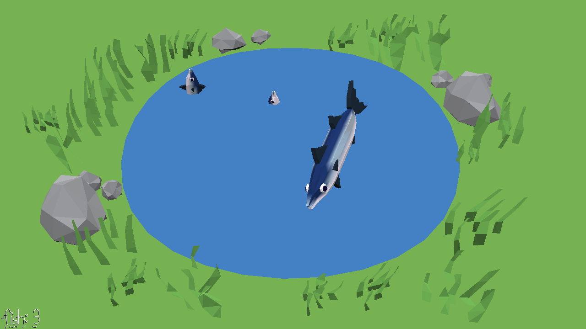

# Whack a Mackerel 

Author: Alyssa Lee

Design: It's like whack a mole, but instead of whacking moles you are whacking fish by throwing other fish at them. 

How To Play: You will start with 5 fish. Use the left click button to throw a fish into the pond, aiming for the fish that pop up. If you hit something then both fish are returned to your stash of fish! 

Sources: Assets created by Alyssa

This game was built with [NEST](NEST.md).

